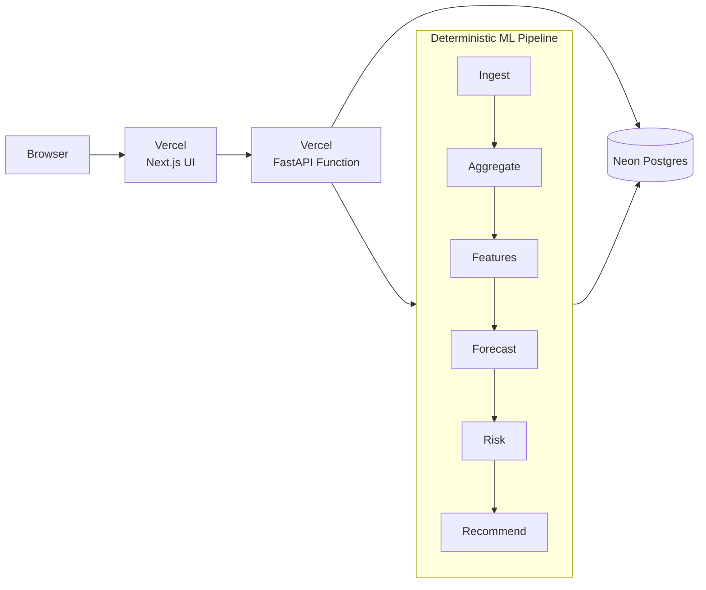
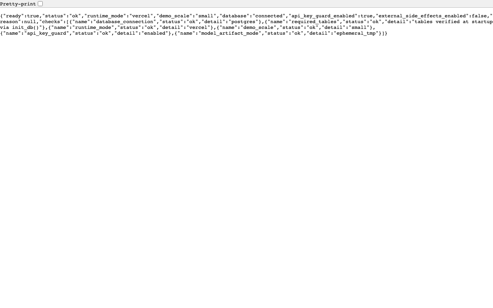
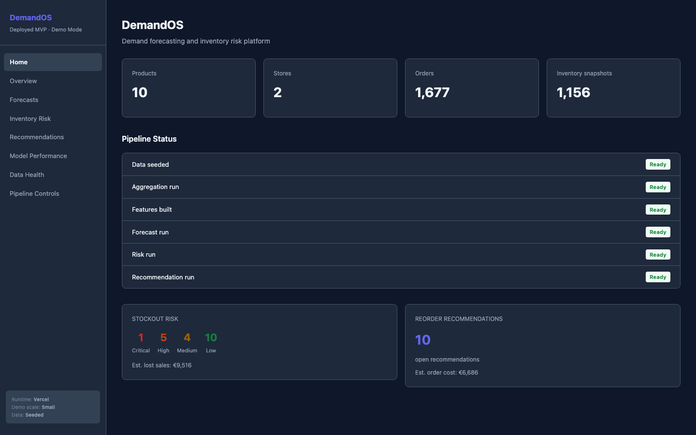
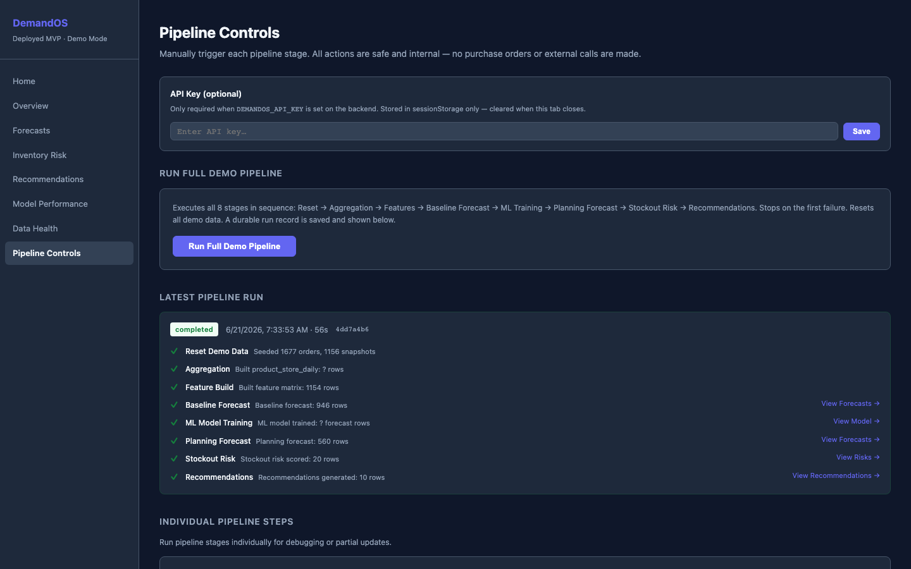
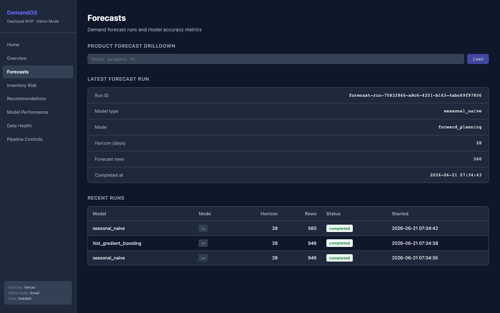
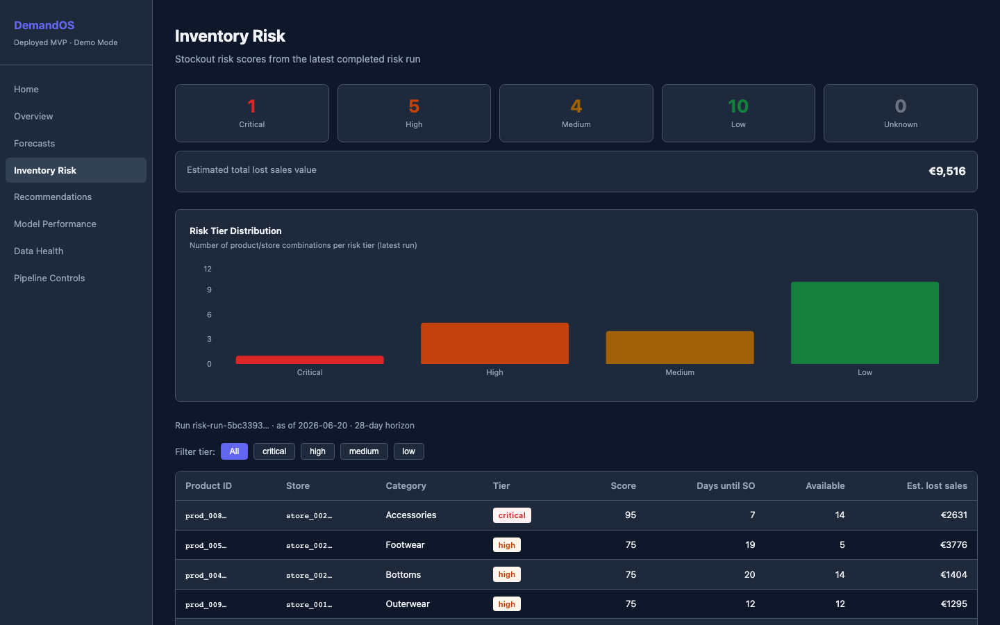
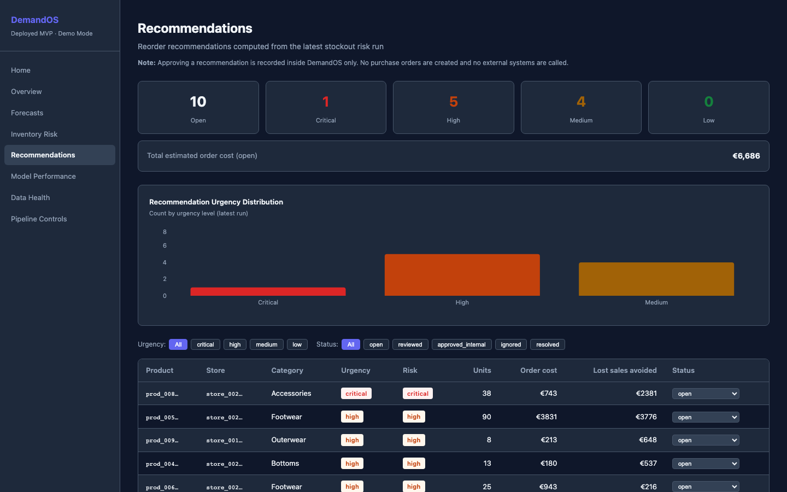
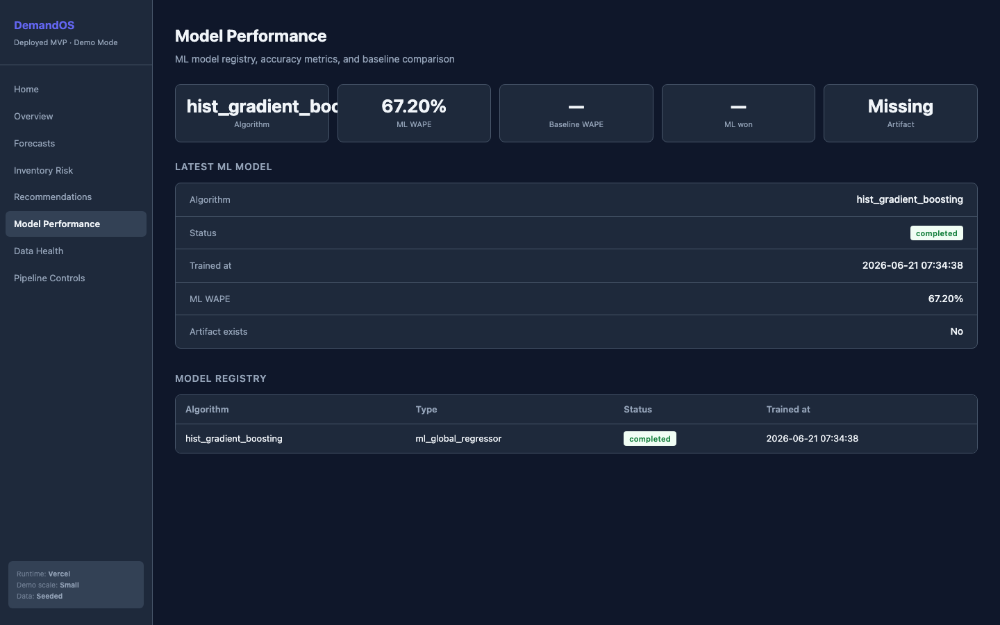
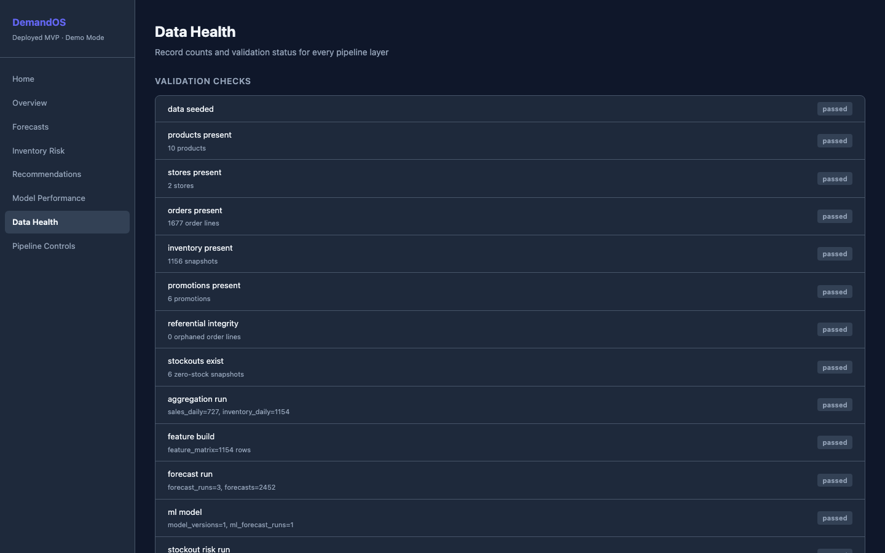
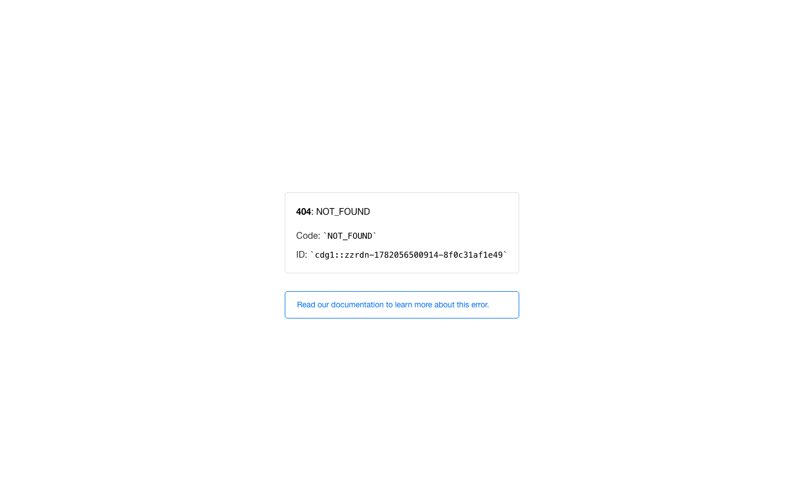

# DemandOS

**Demand forecasting and inventory risk platform — portfolio MVP.**

A deterministic ML pipeline that ingests raw synthetic commerce records and computes
demand forecasts, stockout risk scores, and reorder recommendations — entirely from
raw data, with no hardcoded metrics anywhere.

**Live demo:** [https://demand-os-three.vercel.app](https://demand-os-three.vercel.app)  
**Case study:** [docs/case_study.md](docs/case_study.md)

---

## What DemandOS Is

DemandOS answers three questions for e-commerce and omnichannel retailers:

1. **How much will I sell?** — 28-day demand forecasts per SKU per store (seasonal naive + HistGradientBoosting)
2. **What will run out?** — Stockout risk scores with days-until-stockout and safety stock analysis
3. **What should I order?** — Reorder recommendations using EOQ + safety stock + supplier lead time

All values are computed by the pipeline from raw operational records.
No hardcoded dashboard metrics. No fake outputs.

---

## Architecture



Full pipeline sequence:
```
Connector → Ingestion → Validation → Aggregation → Features
         → Forecasting → Stockout Risk → Recommendations
```

Each stage reads from the database and writes to the database.
No stateful in-memory chains. No LLM at inference time.

See [docs/architecture.md](docs/architecture.md) for detailed diagrams.

---

## Screenshots

Captured via Playwright CLI against the live deployment (2026-06-21):

| | | |
|--|--|--|
|  |  |  |
| `/api/readiness` — Neon connected | Home dashboard — live KPIs | Pipeline Controls — all 8 steps |
|  |  |  |
| Forecasts — p10/p50/p90 chart | Inventory Risk — tier queue | Recommendations — urgency queue |
|  |  |  |
| Model Performance — ML vs baseline | Data Health — table counts | Product Drilldown — per-SKU view |

---

## Features

- **Full ML pipeline** — seasonal naive, moving average, and HistGradientBoosting global model
- **36 leakage-safe features** — lag, rolling windows, calendar, promotions, inventory state, supplier info
- **Honest backtesting** — WAPE/MAE/RMSE reported per model, per category, per store
- **Stockout risk engine** — projected end inventory (p50/p90), days-until-stockout, safety stock, coverage ratio
- **Reorder recommendations** — EOQ-adjacent formulas, urgency tiers, estimated order cost
- **Approval workflow** — operators review/approve/ignore recommendations (no automatic purchasing)
- **Interactive dashboard** — 9 pages, all data live from the API
- **API key guard** — POST/PATCH endpoints require `X-DemandOS-API-Key` header
- **Observability** — pipeline run summaries, failure tracking, readiness probe

---

## Pipeline Stages

| Stage | Service | Tables Written |
|-------|---------|----------------|
| Ingestion | IngestionService + ValidationService | `raw_products`, `raw_orders`, `raw_inventory_snapshots`, `raw_promotions`, … |
| Aggregation | AggregationService | `*_clean`, `sales_daily`, `inventory_daily`, `product_store_daily` |
| Feature Engineering | FeatureService | `feature_matrix` (36 columns) |
| Baseline Forecasting | ForecastingService | `forecast_runs`, `forecasts`, `model_metrics` |
| ML Training | TrainingService | `model_versions`, `forecasts`, `model_metrics` |
| Planning Forecast | ForecastingService | `forecasts` (forward_planning mode) |
| Stockout Risk | StockoutService | `stockout_risk_runs`, `stockout_risks` |
| Recommendations | RecommendationService | `recommendation_runs`, `reorder_recommendations` |

---

## Deployment Architecture

```
Vercel Project (repo root)
├── / → apps/web (Next.js, @vercel/next)
└── /api/* → api/index.py (FastAPI, @vercel/python)
             └── Neon Postgres (DATABASE_URL via Marketplace)
```

**Required environment variables (Vercel panel):**

| Variable | Value |
|----------|-------|
| `DEMANDOS_API_KEY` | A strong random string |
| `DEMANDOS_RUNTIME_MODE` | `vercel` |
| `DEMANDOS_DEMO_SCALE` | `small` |
| `DATABASE_URL` | Injected automatically by Neon integration |

`NEXT_PUBLIC_API_BASE_URL` must be **left unset** (same-origin calls).

**Serverless limitations:**
- Model artifacts are ephemeral (`/tmp`) — retrain after cold start if serialized model needed
- No background jobs; pipeline runs synchronously within a single request
- 60s function timeout limits data scale; use a dedicated backend for production volumes

See [docs/deployment.md](docs/deployment.md) for full setup instructions.

---

## Local Setup

### Prerequisites
- Python 3.11+
- Node.js 18+
- Docker (optional, for local Postgres)

### Backend

```bash
cd apps/api
python -m venv .venv
source .venv/bin/activate
pip install -e ".[dev]"
cp .env.example .env
uvicorn app.main:app --reload --port 8000
```

API docs: http://localhost:8000/docs

### Frontend

```bash
cd apps/web
npm install
# Create .env.local with: NEXT_PUBLIC_API_URL=http://localhost:8000
npm run dev
```

Dashboard: http://localhost:3000

### Database (local Postgres via Docker)

```bash
docker-compose up -d db
```

---

## Running Tests

```bash
cd apps/api
pytest
```

709 tests across 15 files. Uses SQLite in-memory — no external DB required.

---

## Verify Everything

```bash
bash scripts/verify.sh
```

100+ structural checks: required files, schema purity, migration count, Vercel adapter,
no forbidden derived fields in raw schemas, Sprint 10/11/12 additions.

---

## Production Smoke Validation

```bash
# Read-only check (no data mutation)
python scripts/smoke_production.py --base-url https://demand-os-three.vercel.app

# Full check including pipeline run (requires API key)
python scripts/smoke_production.py \
  --base-url https://demand-os-three.vercel.app \
  --api-key "$DEMANDOS_API_KEY" \
  --run-pipeline
```

18 checks: readiness, all dashboard endpoints, runtime mode, demo scale,
core data counts, recommendations, no secrets leaked in any response.

**Latest result (2026-06-21): 18/18 passed.**

---

## Safety Boundaries

DemandOS is an **internal prototype with explicit safety boundaries**:

- No real purchase orders are created
- No emails or Slack messages are sent
- No supplier webhooks are triggered
- No external API calls are made by the pipeline services
- `approved_internal` status means approved inside DemandOS only — no external action

This is enforced by design: `RecommendationService` has no HTTP client and no
external call sites. Tests verify this.

---

## What Is Intentionally Not Implemented

| Feature | Reason |
|---------|--------|
| Real Shopify/WooCommerce/ERP connectors | Requires API credentials; out of MVP scope |
| Real purchase order creation | Safety boundary — internal suggestions only |
| Email/Slack notifications | External side effects; excluded by design |
| User accounts / JWT auth | Overkill for single-operator demo |
| Calibrated probabilistic intervals | p10/p90 are ±1σ heuristics, documented as such |
| Background schedulers | Serverless constraint |
| CSV upload connector | Stub ready; implementation deferred |
| Model monitoring / drift detection | Post-MVP roadmap |

---

## Roadmap

**Next (Sprint 13+):**
- `CsvCommerceConnector` — real file parsing with column mapping
- `ShopifyConnector` — Admin API ingestion
- Calibrated prediction intervals (conformal prediction)
- Model monitoring and drift detection

**Infrastructure (if moving beyond prototype):**
- Dedicated FastAPI backend on Render/Railway/Fly.io (removes 60s limit)
- Scheduled pipeline runs
- User accounts with scoped permissions

---

## Sprint Status

| Sprint | Goal | Status |
|--------|------|--------|
| 0 | Scaffold | ✅ Done |
| 1 | Mock data generator (50 SKUs × 5 stores × 2yr) | ✅ Done |
| 2 | Aggregation pipeline | ✅ Done |
| 3 | Feature engineering (leakage-safe, 36 columns) | ✅ Done |
| 4 | Baseline forecasting + backtesting | ✅ Done |
| 5 | ML forecasting (HistGradientBoosting) + model registry | ✅ Done |
| 6 | Stockout risk engine | ✅ Done |
| 7 | Reorder recommendation engine | ✅ Done |
| 8 | Backend API hardening + dashboard data contracts | ✅ Done |
| 9 | Dashboard UX + safe pipeline controls + API key guard | ✅ Done |
| 10 | Demo orchestration + product drilldown + Vercel deployment | ✅ Done |
| 10B | Single Vercel project adapter | ✅ Done |
| 10C | Postgres FK insert order fix for Neon | ✅ Done |
| 11 | Production smoke validation + observability + case study prep | ✅ Done |
| **12** | **Final screenshots, case study, MVP closeout** | **✅ Done** |

---

## MVP Status

**DemandOS MVP: COMPLETE**

- Deployed at [https://demand-os-three.vercel.app](https://demand-os-three.vercel.app)
- 709 backend tests passing
- Frontend build passing
- CI green
- Production smoke: 18/18 checks passed
- All dashboard pages show live computed data
- Case study: [docs/case_study.md](docs/case_study.md)
- Screenshots: [docs/screenshots/](docs/screenshots/)

---

## References

- [Nixtla/mlforecast](https://github.com/Nixtla/mlforecast) — global ML forecasting patterns
- [M5 Competition methods](https://github.com/Mcompetitions/M5-methods) — retail forecasting discipline
- [ecom_sales_data_generator](https://github.com/G-Schumacher44/ecom_sales_data_generator) — synthetic data patterns
- [inventory-optimization](https://github.com/virbahu/inventory-optimization) — EOQ, safety stock, ROP
- [unit8co/darts](https://github.com/unit8co/darts) — optional deep learning comparison

See [docs/reference_repositories.md](docs/reference_repositories.md) for details.
