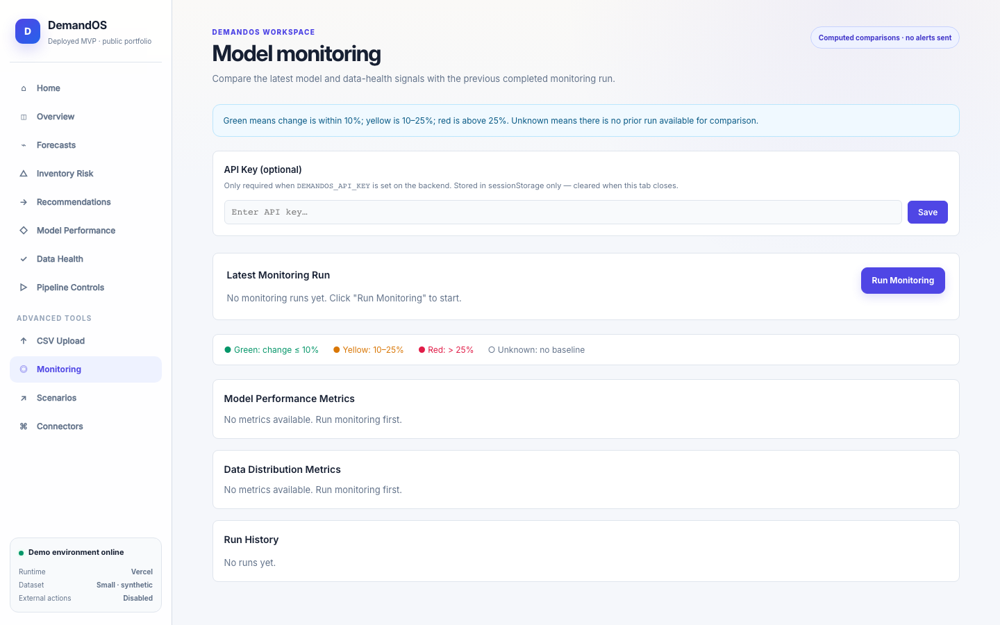
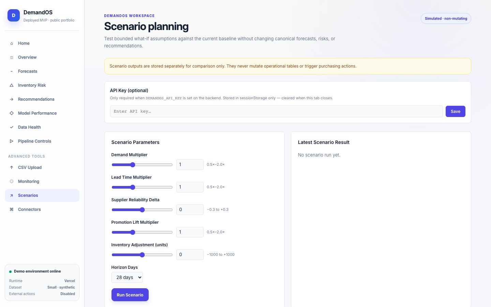
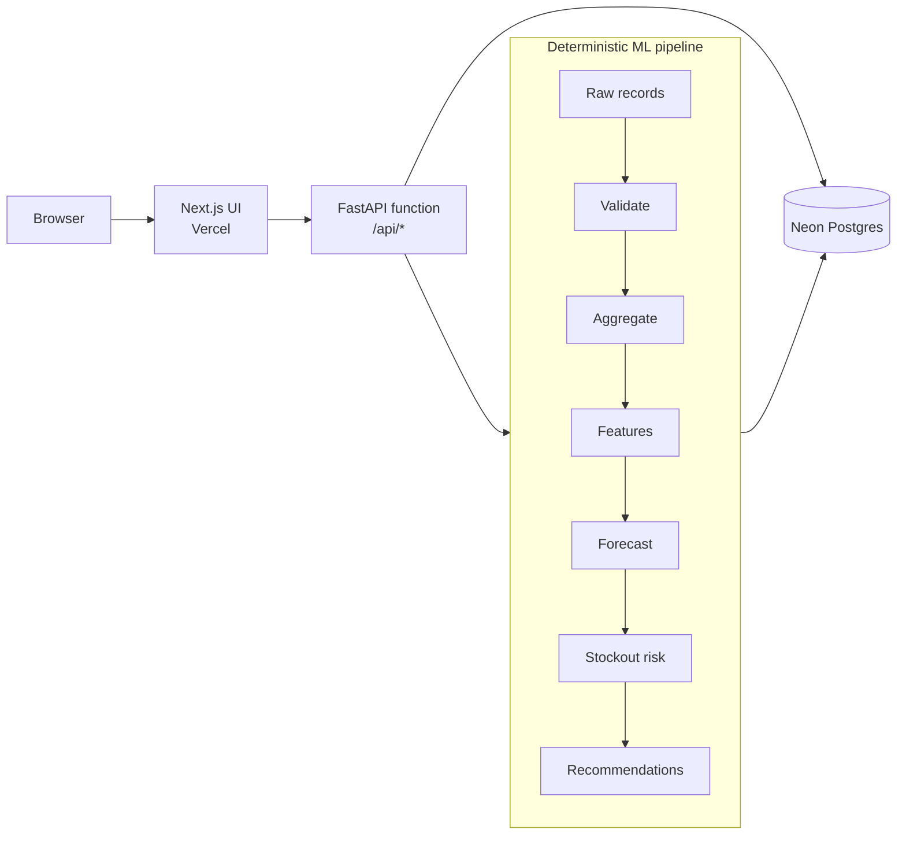

# DemandOS

**A public portfolio prototype for demand forecasting, inventory risk, and internal reorder planning.**

[Live demo](https://demand-os-three.vercel.app) · [Case study](docs/case_study.md) · [Release notes](docs/release_notes.md) · [Architecture](docs/architecture.md)

DemandOS turns raw commerce records into demand forecasts, product/store stockout
risk, and human-reviewed reorder recommendations. The workflow is deterministic:
there is no LLM at inference time, no hardcoded dashboard metrics, and no external
purchasing action.

> **Current status:** Public portfolio prototype / portfolio MVP. The deployed demo
> uses synthetic raw operational data and is not a customer production system.

## Screenshots

| Home dashboard | Forecasts | Inventory risk |
|---|---|---|
|  |  |  |

| Recommendations | Monitoring | Scenarios |
|---|---|---|
|  |  |  |

See [docs/screenshots/README.md](docs/screenshots/README.md) for the complete capture
list and redaction rules. Advanced-feature screenshots may be marked pending until
the refreshed UI is deployed.

## Core Features

- Raw synthetic commerce ingestion for products, stores, suppliers, orders,
  inventory snapshots, promotions, and purchase orders
- Leakage-safe feature engineering with lag, rolling, calendar, promotion,
  inventory, price, margin, and lifecycle inputs
- Seasonal-naive and moving-average baselines plus a global
  `HistGradientBoostingRegressor`
- Honest backtesting with WAPE, MAE, RMSE, SMAPE, and bias
- Deterministic stockout-risk scoring by product and store
- Safety stock, reorder-point, and quantity recommendations for human review
- Product drilldown, data-health checks, pipeline controls, and durable run history

## Advanced Features

- **CSV upload:** validates and ingests raw operational CSV records with a 2 MB
  prototype limit. Derived/precomputed forecast, risk, and recommendation fields
  are rejected.
- **Monitoring:** compares model and data-health metrics with the previous completed
  run using documented green/yellow/red thresholds.
- **Scenario planning:** runs bounded, simulated what-if comparisons without mutating
  canonical forecasts, risks, recommendations, or inventory.
- **Connector preparation:** disabled Shopify and WooCommerce stubs support
  configuration-shape validation and no-network dry runs. No live connector calls exist.

## Architecture



Every stage reads from and writes to the database. Pipeline services do not call
one another in memory, and no agent or LLM participates in runtime decisions.

## Data Pipeline

```text
Connector
  → IngestionService + ValidationService
  → AggregationService
  → FeatureService
  → ForecastingService / TrainingService
  → StockoutService
  → RecommendationService
```

Inputs are raw operational records only. Forecasts, risk scores, safety stock,
reorder points, and recommendation quantities are always computed inside DemandOS.

## Deployment Architecture

One Vercel project serves both applications:

```text
/       → apps/web (Next.js)
/api/*  → api/index.py (FastAPI Python function)
             └── Neon Postgres
```

The deployment uses `DEMANDOS_RUNTIME_MODE=vercel` and the small synthetic demo
scale. `NEXT_PUBLIC_API_BASE_URL` remains unset so browser requests use same-origin
`/api/*` routes. See [docs/deployment.md](docs/deployment.md).

## Local Setup

Prerequisites: Python 3.11+, Node.js 18+, and optionally Docker for local Postgres.

```bash
# Backend
cd apps/api
python -m venv .venv
source .venv/bin/activate
pip install -e ".[dev]"
cp .env.example .env
uvicorn app.main:app --reload --port 8000
```

```bash
# Frontend
cd apps/web
npm ci
# Create .env.local with NEXT_PUBLIC_API_BASE_URL=http://localhost:8000
npm run dev
```

## Verification

```bash
cd apps/api && pytest
cd ../..
python scripts/public_readiness_check.py
bash scripts/verify.sh
cd apps/web && npm run typecheck --if-present && npm run build
```

The backend suite uses isolated test databases and does not call real external APIs.

## Production Smoke

Read-only validation:

```bash
python scripts/smoke_production.py \
  --base-url https://demand-os-three.vercel.app
```

The optional protected pipeline smoke mutates demo data only when both an API key
and `--run-pipeline` are explicitly supplied:

```bash
python scripts/smoke_production.py \
  --base-url https://demand-os-three.vercel.app \
  --api-key "$DEMANDOS_API_KEY" \
  --run-pipeline
```

## Safety Boundaries

- Synthetic raw commerce data only; no real customer or client data
- No automatic purchase orders or supplier communication
- No email, Slack, webhook, or background-job side effects
- No live Shopify or WooCommerce API calls
- Scenario planning is simulated and non-mutating
- `approved_internal` means reviewed inside DemandOS only
- API keys are never stored in the database or returned by read endpoints
- Generated CSV dumps and model artifacts are excluded from version control

## What Is Intentionally Not Implemented

| Capability | Status |
|---|---|
| Real Shopify/WooCommerce sync | Disabled stubs only |
| Real purchase-order creation | Excluded safety boundary |
| Supplier email/Slack alerts | Excluded external side effect |
| Customer accounts / multi-tenancy | Outside portfolio MVP scope |
| Scheduled background pipeline | Not supported by the serverless prototype |
| Large-file ingestion | CSV prototype limit is 2 MB |
| Calibrated probabilistic intervals | Current p10/p90 bands are documented heuristics |

## Roadmap

- Calibrated forecast intervals and richer backtesting diagnostics
- Dedicated backend and scheduled runs for larger datasets
- Persistent model-artifact storage
- Real connectors only after credential management, privacy review, rate limiting,
  retries, and explicit operator approval are designed

## License and Status

DemandOS is a public portfolio prototype. No repository license has been selected,
so normal copyright restrictions apply unless a license is added later. See
[docs/release_notes.md](docs/release_notes.md) for release status and limitations.
